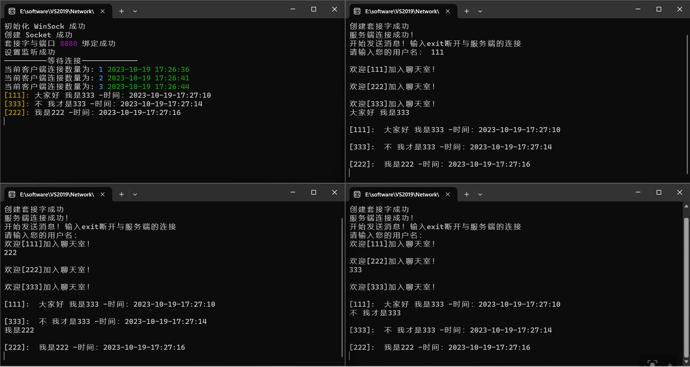
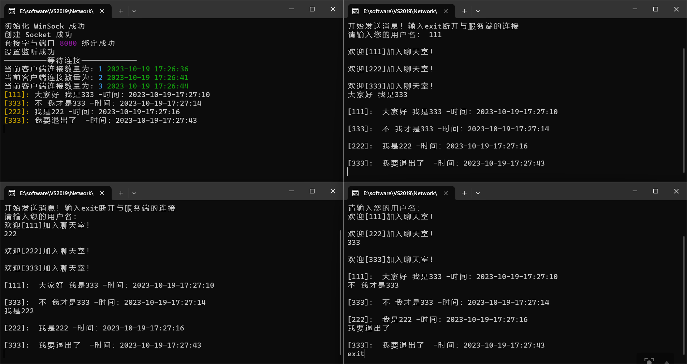
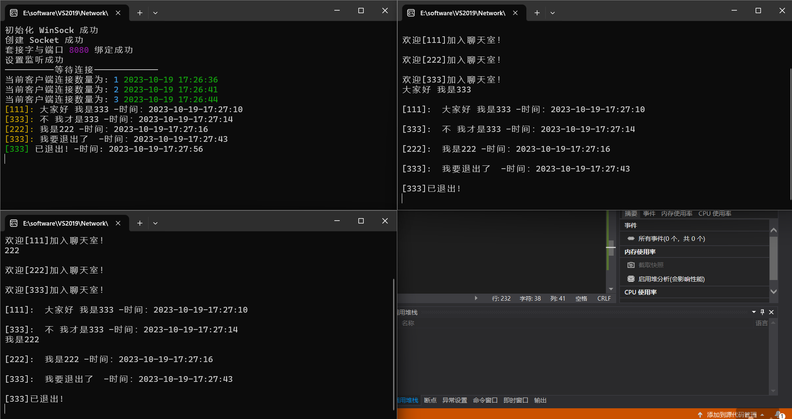

<center> <h1>计算机网络实验报告 </h1> </center>
<center> 实验一：Socket编程 </center>
<center> 计算机科学与技术 2110937 赵康明 </center>

## 一、前期准备
### 1.socket 
    两个程序之间的双向通信需要借助socket连接实现数据交换。socket被称为“套接字”，用于描述IP地址和端口，用于实现虚拟机和计算机之间的通信。

socket包含以下两种类型：
- 数据报套接字：使用UDP协议，支持主机之间面向非连接、不可靠的数据报传输。
- 流式套接字：使用TCP协议，支持主机之间面向连接的、顺序的、可靠的、全双工字节流传输

### 2.socket连接过程
根据连接启动的方式以及本地套接字要连接的目标，套接字之间的连接过程可以分为三个步骤：服务器监听，客户端请求，连接确认。

    1.服务器监听：是服务器端套接字并不定位具体的客户端套接字，而是处于等待连接的状态，实时监控网络状态
    2.客户端请求：是指由客户端的套接字提出连接请求，要连接的目标是服务器端的套接字。为此，客户端的套接字必须首先描述它要连接的服务器的套接字，指出服务器端套接字的地址和端口号，然后就向服务器端套接字提出连接请求。
    3.连接确认：是指当服务器端套接字监听到或者说接收到客户端套接字的连接请求，它就响应客户端套接字的请求，建立一个新的线程，把服务器端套接字的描述发给客户端，一旦客户端确认了此描述，连接就建立好了。而服务器端套接字继续处于监听状态，继续接收其他客户端套接字的连接请求。


## 二、协议设计

依据实验要求，本次实验采取如下协议：
- 使用TCP传输协议，选用流式套接字，采用多线程方式完成程序
- 分别设计Client(用户端)和Sever(服务端)，实现通信
本次实验设计为用户端和服务端均能相互接收和发送消息，为提高效率，采取多线程的方式进行，即一个线程用于接收信息、一个线程用于发送信息。
    
        实现本次聊天室功能首先需要开启服务端，进行初始化Winsock库和创建服务端serversocket，并将severSocket与端口绑定，之后进行监听，看是否有用户端请求连接。服务端设置线程用于接收消息并进行广播。

        对于用户端，启动后需要输入自定义的用户名，之后便可以进行发送消息了。用户端设置两个线程，一个用于接收消息、一个用于发送消息。


## 三、程序设计
### 1.实验环境
- Win11系统，Visual Studio2019
- 所需库：WinSock2、ws_32.lib等
### 2.服务端
<p>多人聊天室设计一个服务端，用于监听端口，查看是否有客户端进行连接。如有客户端连接，则开始接收客户端所发送的消息，并对其余所连接的客户端进行广播消息。</p>
  
***头文件声明及宏定义***
  
在头文件中引入了所需要的头文件和socket编程所需要的两个库，并且定义了端口号和接收和发送信息的缓冲区大小。定义了所需要的用户端的socket数组和socketaddr数组，服务器端地址和socket。同时定义了一个map类型的数据```client```，用于存储用户socket和用户名之间的映射关系，方便对接收消息进行用户名确认。
```c
#include <iostream>
#include <cstdlib>
#include <cstring>
#include <chrono>
#include <thread>
#include <WinSock2.h>
#include <ws2tcpip.h>
#include <ctime>
#include<map>

#pragma comment(lib, "ws2_32.lib") // socket库
using namespace std;
#define PORT 8080                       // 端口号
#define MaxClient 5                     // 最大连接数
#define _CRT_SECURE_NO_WARNINGS         // 禁止使用不安全的函数报错
#define _WINSOCK_DEPRECATED_NO_WARNINGS // 禁止使用旧版本的函数报错
#define ipAddr "127.0.0.1"
#define RecvBufSize 2048 // 缓冲区大小
#define SendBufSize 2048

SOCKET clientSocket[MaxClient];    // 客户端socket数组 用来存放每个线程的socket
SOCKET serverSocket;                // 服务器端socket
SOCKADDR_IN clientAddrs[MaxClient]; // 客户端地址数组
SOCKADDR_IN serverAddr;             // 定义服务器地址
int connect_num = 0; // 当前连接的客户数
int connectCondition[MaxClient] = {}; // 每一个连接的情况
map<SOCKET, string>client;
```
***ThreadFun线程函数***

  该函数用于接收消息并进行广播。

-  在这个线程中，设置使用了一次接收消息---用于接收用户名，第二次接收消息放置于循环当中，不断接收客户端新的发送消息，并将其广播。
```c
DWORD WINAPI ThreadFunction(LPVOID lpParameter) // 线程函数
{

    int recvlen = 0;
    char RecvBuf[RecvBufSize];
    char SendBuf[SendBufSize];
    //SOCKET c = (SOCKET)lpParameter;// 为当前连接建立索引
    int index = (int)lpParameter;
    //recvlen = recv(clientSocket[index], RecvBuf, sizeof(RecvBuf), 0);
    char username[1024] = { 0 };
    recvlen = recv(clientSocket[index], username, sizeof(username), 0);
    client[clientSocket[index]] = string(username);
    string bufsend;
    bufsend = "欢迎[" + client[clientSocket[index]] + "]加入聊天室！";
    // 将所有信息同步到各个客户端
    for (int i = 0; i < MaxClient; i++)
    {
        // 注意 此时需要看是否被连接 故需要用connectCondition

        if (connectCondition[i] == 1)
        {
            send(clientSocket[i], bufsend.data(), sizeof(bufsend), 0);
        }
    }
    while (1)
    {
        
        recvlen = 0;
        recvlen = recv(clientSocket[index], RecvBuf, sizeof(RecvBuf), 0);
        if (recvlen > 0)
        {
            //创建时间戳，记录当前通讯时间
            auto currentTime = chrono::system_clock::now();
            time_t timestamp = chrono::system_clock::to_time_t(currentTime);
            tm localTime;
            localtime_s(&localTime, &timestamp);
            char timeStr[50];
            strftime(timeStr, sizeof(timeStr), "%Y-%m-%d-%H:%M:%S", &localTime); // 格式化时间
            string str = "[" + client[clientSocket[index]] + "]: ";
            cout << ANSI_COLOR_YELLOW<<str<<ANSI_RESET<< RecvBuf<< " -时间：" << timeStr << endl;
            sprintf_s(SendBuf, sizeof(SendBuf), "%s %s -时间：%s ", str.data(), RecvBuf,timeStr); // 格式化发送信息
            // 将所有信息同步到各个客户端
            for (int i = 0; i < MaxClient; i++)
            {
                // 注意 此时需要看是否被连接 故需要用connectCondition

                if (connectCondition[i] == 1)
                {
                    send(clientSocket[i], SendBuf, sizeof(SendBuf), 0);
                }
            }
        }
       
```

-  如果客户端断开了连接，那么此时将其退出聊天室的消息广播给其他用户端。并将其连接状态置为0，表示未连接。
  ```c
    else
        {
            if (GetLastError() == 10054)  // 关闭连接
            {
                // 时间输出 
                auto currentTime = chrono::system_clock::now();
                time_t timestamp = chrono::system_clock::to_time_t(currentTime);
                tm localTime;
                localtime_s(&localTime, &timestamp);
                char timeStr[50];
                strftime(timeStr, sizeof(timeStr), "%Y-%m-%d-%H:%M:%S", &localTime); // 格式化时间
                string str = "[" + client[clientSocket[index]] + "]";
                cout <<ANSI_COLOR_GREEN<<str<<ANSI_RESET << " 已退出! -时间: " << timeStr << endl;
                         sprintf_s(SendBuf, sizeof(SendBuf), "%s %s -时间：%s ", str.data(), RecvBuf, timeStr); // 格式化发送信息
           // 将所有信息同步到各个客户端
                for (int i = 0; i < MaxClient; i++)
                {
                    // 注意 此时需要看是否被连接 故需要用connectCondition

                    if (connectCondition[i] == 1)
                    {
                        send(clientSocket[i], SendBuf, sizeof(SendBuf), 0);
                    }
                }
                closesocket(clientSocket[index]);
                connect_num--;
                connectCondition[index] = 0;// 置为未连接
                return 0;
            }
            else
            {
                cout << "接收失败" << endl;
                break;
            }
        }
    }
}
```

***主函数***

- 服务器监听

    - 在启动服务器监听之前，我们首先需要进行WinSock2库的初始化，检查初始化是否成功。
    - 其次创建服务器套接字 serverSocket，并绑定服务器地址和端口。
  ```c
  // 初始化WinSock库
    WSAData wsaData;
    if (WSAStartup(MAKEWORD(2, 1), &wsaData) != 0) {
        cout << "初始化 WinSock失败" << endl;
    }
    else {
        cout << "初始化 WinSock 成功" << endl;
    }

    serverSocket = socket(AF_INET, SOCK_STREAM, IPPROTO_TCP);
    /*
    AF_INET：使用ipv4（AF是指定地址族的宏，Address Family），也可以使用PF_INET,在使用Socket API进行套接字编程时二者是等价的
    SOCK_STREAM：套接字类型，保证了数据的有序性，确保了数据的完整性和可靠性，以及提供了流式传输的特性，确保传输的数据按照发送顺序被接收
                 同时还是实验要求的一部分
    IPPROTO_TCP：使用TCP传输协议
    */

    if (serverSocket == INVALID_SOCKET) // 错误处理
    {
        cout << "创建 Socket 错误" << endl;
        return 0;
    }
    cout << "创建 Socket 成功" << endl;

    // 绑定ip地址和服务器地址
    serverAddr.sin_family = AF_INET;   // 地址类型
    serverAddr.sin_port = htons(PORT); // 端口号
    inet_pton(AF_INET, ipAddr, &(serverAddr.sin_addr));
    if (bind(serverSocket, (LPSOCKADDR)&serverAddr, sizeof(serverAddr)) == SOCKET_ERROR) // 将服务器套接字与服务器地址和端口绑定
    {
        cout << "套接字与端口绑定失败" << endl;
        return 0;
    }
    else
    {
        cout << "套接字与端口 " ANSI_COLOR_MAGENTA << PORT << ANSI_RESET " 绑定成功" << endl;
    }

    // 设置监听/等待队列
    if (listen(serverSocket, MaxClient) != 0)
    {
        cout << "设置监听失败" << endl;
        return 0;
    }
    else
    {
        cout << "设置监听成功" << endl;
    }

    cout << "----------等待连接-------------" << endl;```

- 之后我们将对端口进行监听，以便接受客户端连接请求
- 之后通过一个循环对用户端的连接请求进行处理，创建新的线程进行处理用户端通信

```c
 while (true)
    {
        if (connect_num < MaxClient)
        {
            int num = check();
            int addrlen = sizeof(SOCKADDR);
            clientSocket[num] = accept(serverSocket, (sockaddr*)&clientAddrs[num], &addrlen); // 等待客户端请求

            // 获取客户端ip地址
            char clientIp[INET_ADDRSTRLEN] = "";
            inet_ntop(AF_INET, &(clientAddrs[num].sin_addr), clientIp, INET_ADDRSTRLEN);

            if (clientSocket[num] == SOCKET_ERROR)
            {
                perror("客户端出错 \n");
                closesocket(serverSocket);
                WSACleanup();
                exit(EXIT_FAILURE);
            }
            connectCondition[num] = 1;// 连接位置1表示占用
            connect_num++; // 当前连接数加1

            // 创建时间戳，记录当前通讯时间
            auto currentTime = chrono::system_clock::now();
            time_t timestamp = chrono::system_clock::to_time_t(currentTime);
            tm localTime;
            localtime_s(&localTime, &timestamp);
            char timeStr[50];
            HANDLE Thread = CreateThread(NULL, 0, (LPTHREAD_START_ROUTINE)ThreadFunction, (LPVOID)num, 0, NULL); // 创建线程
        
            strftime(timeStr, sizeof(timeStr), "%Y-%m-%d %H:%M:%S", &localTime); // 格式化时间
           
            cout << "当前客户端连接数量为: " ANSI_COLOR_CYAN << connect_num << ANSI_RESET <<" "<<ANSI_COLOR_GREEN << timeStr << ANSI_RESET << endl;

            if (Thread == NULL) // 线程创建失败
            {
                perror("线程创建失败\n");
                exit(EXIT_FAILURE);
            }
            else
            {
                CloseHandle(Thread);
            }
        }
        else
        {
            cout << "客户端数量已满" << endl << endl;
        }
    }

    closesocket(serverSocket);
    WSACleanup();
 
```
###  3.用户端
用户端的代码设计思路为：
  - 和服务端建立连接
  - 创建接收线程用于接收服务端发回来的消息
  - 主线程用于发送消息给服务端，服务端再将其广播
***建立连接***
```c
	// 初始化 Windows Sockets API
	WSADATA wsaData;
	if (WSAStartup(MAKEWORD(2, 1), &wsaData) != 0) //成功返回0
	{
		cout << "初始化WinSock库失败" << endl;
		return 0;
	}
	else
	{
		cout << "初始化WinSock库成功！" << endl;
	}
	// 1.创立好句柄
	sockClient = socket(AF_INET, SOCK_STREAM, 0);
	if (sockClient == INVALID_SOCKET)
	{
		cout << "创建Socket失败" << endl;
		WSACleanup();
		return 0;
	}
	else
	{
		cout << "创建套接字成功" << endl;
	}
	/*
	 学习：
	 - socket 函数是用于创建套接字的函数
	 - sockClient 将存储创建的套接字的句柄
	 - AF_INET 是地址族（Address Family），表示使用 IPv4 地址族，用于 Internet 地址
	 - 第二个参数表示使用流失套接字，即TCP协议
	 - 使用TCP时第三个参数为0
	*/
	// 2.建立连接
	SOCKADDR_IN serverAddr;//服务端地址
	serverAddr.sin_family = AF_INET;
	serverAddr.sin_port = htons(8080);
	//serverAddr.sin_addr.s_addr = inet_addr("127.0.0.1");
	inet_pton(AF_INET, IP, &(serverAddr.sin_addr));
	/* IP 地址字符串转换为二进制表示，并将结果存储在 serverAddr.sin_addr 中，
	以便在后续的套接字操作中使用。这通常用于将人类可读的 IP 地址
	（如 "127.0.0.1"）转换为套接字需要的二进制格式。
	*/
	//serverAddr.sin_addr.s_addr = inet_addr("localhost");
	if (connect(sockClient, (SOCKADDR*)&serverAddr, sizeof(sockaddr_in))==SOCKET_ERROR)
	{
		cout << "服务端连接失败！" << WSAGetLastError() << endl;
		closesocket(sockClient);
		WSACleanup();
		return 0;
	}
	else
	{
		cout << "服务端连接成功！" << endl;
		
	}
```
***接收消息线程***
```c
// 接收消息的线程
DWORD WINAPI  RecvThread()
{
	while (1)
	{
		char msgbuf[2048];
		memset(msgbuf, 0, sizeof(msgbuf));

		if (recv(sockClient, msgbuf, sizeof(msgbuf), 0) > 0)
		{


			cout << endl;
			cout << msgbuf << endl;
		}
		else if (recv(sockClient, msgbuf, sizeof(msgbuf), 0) == 0)
		{
			cout << endl;
			cout << "服务端已断开" << endl;
			break;
		}
	}
	return 0;
}
```
***发送消息线程***
用户端可以通过输入exit退出循环，即关闭聊天室，其余可通过输入其他消息进行交流。
```c
char msg[1024];
	memset(msg, 0, sizeof(msg));
	cout << "开始发送消息！输入exit断开与服务端的连接" << endl;
	char username[1024];
	cout << "请输入您的用户名： ";
	cin.getline(username, sizeof(username));
	//发送名字
	send(sockClient, username, sizeof(username), 0);
	// 这里用于发送信息
	while (1)
	{
		cin.getline(msg, sizeof(msg));
		if (strcmp(msg, "exit") == 0)
		{
			break;
		}
		//char message[2048];
		//sprintf_s(message, "%s: %s", username, msg);
		//send(sockClient, message, sizeof(message), 0);

		send(sockClient, msg, sizeof(msg), 0);
	}
	//关闭socket
	closesocket(sockClient);
	WSACleanup();
	return 0;
```
## 四、实验结果
运行成功后开启一个服务端，三个用户端，分别进行聊天测试，结果符号实验预期。
本次实验的所有地址都设置为了回环地址，可以在任何电脑上进行运行测试。
- 如下为多人聊天测试，发现每个人加入聊天室都会对所有在线客户端进行广播

- 交流测试

- 输入exit退出测试，服务端会将用户退出的消息广播给其他在线用户端！

## 五、思考与总结
本次实验成功实现了利用socket编程实现多人聊天室，从中学习到了建立网络通信需要的几个步骤及其方法。、

同时在实验过程中也遇到了许多问题，如实现自定义用户名并在每次消息广播的过程中均将用户名一同发送，在查询解决资料得到了解决方案：即引入map映射，将用户端的socket与用户名建立联系，这样就能根据线程来选取用户名将其加入到需要广播的信息当中。

此外本次实验还有进一步提高的空间，如加入私聊功能。本质是将广播给所有在线线程改为有选取的发送给特定线程。思考有的解决方案有两种：
- 引入线程池
- 让用户输入想要发送的用户名，并通过建立好的map映射关系发送给相应线程

个人认为第二种的改进方式建立在已经建立好的map映射上实现较为容易，但由于时间限制并未做出实质性的功能完成。

