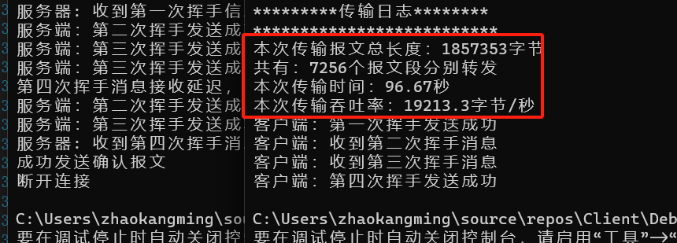

<style>
table {
margin: auto;
}
p{
    margin:auto;
}
</style>
<p align="center">

# 计算机网络实验报告
## 实验3-1:基于UDP服务设计可靠传输协议并编程实现
2110937 赵康明 计算机科学与技术

</p>

## 1.实验要求
（1）实现单向数据传输（一端发数据，一端返回确认）。

（2）对于每个任务要求给出详细的协议设计。

（3）完成给定测试文件的传输，显示传输时间和平均吞吐率。

（4）性能测试指标：吞吐率、延时，给出图形结果并进行分析。

（5）完成详细的实验报告（每个任务完成一份，主要包含自己的协议设计、实现方法、遇到的问题、实验结果，不要抄写太多的背景知识）。

（6）编写的程序应该结构清晰，具有较好的可读性。

（7）提交程序源码、可执行文件和实验报告。
***
## 2.协议设计
### 2.1 实验设计说明
    本次实验要求我们使用UDP编程实现可靠数据传输。在完成本次实验中，我采取了和TCP建立连接和断开连接一致的三次握手和四次挥手的机制，
    在传输数据的过程中，为实现可靠数据传输，我采取了计算校验和的方式用于保证数据包的正确性；同时基于课堂所学习的rdt3.0，引入超时重传机制，对于一段时间未接收到理应收到的数据包，采取重传机制，以防传输途中数据包的丢失。
### 2.2 HeadMsg设计
```c
struct  HeadMsg
{
    u_short len;			// 数据长度16位
    u_short checkSum;		// 16位校验和
    u_short flag; 
    u_short ack;
    u_short seq;		// 序列号
    HeadMsg()
    {
        checkSum = 0;
        len = 0;
        seq = 0;
        flag = 0;
        ack = 0;
    }
};
```
该数据头将在每次发送中发在消息头部，用于校验数据包是否正确。
其中的checkSum作为校验和存在在数据包中。而计算校验和的方式如下：

* 发送端：将数据包的头部进行16位二进制反码求和运算，将计算结果填入校验和当中
* 接收端：按16位整数序列，采用16位二进制反码求和运算

### 2.3 消息类型的设计
在消息类型当中，设计了一个叫flag的标志位，其用于标记该消息的类型，声明了一些常量用于表示数据类型，包含以下：
flag的大小为16位，我们用后六位来标记其类型(从低到高)：

- SYN:用于握手连接
- ACK：用于表示确认消息
- SYN_ACK：用于表示单向连接成功
- FIN：用于挥手断开连接
- FIN_ACK：用于表示单向断开连接成功
- OVER:用于表示文件传输结束
- OVER_ACK:用于表示文件传输结束信号发送成功
- FINAL_CHECK：用于表示断开连接结束信号发送成功
```c
const unsigned char SYN = 0x1; //SYN = 1 ACK = 0
const unsigned char ACK = 0x2;//SYN = 0, ACK = 1，FIN = 0
const unsigned char SYN_ACK = 0x3;//SYN = 1, ACK = 1
const unsigned char FIN = 0x4;//FIN = 1 ACK = 0
const unsigned char FIN_ACK = 0x5;
//FINAL_CHECK=1.FIN=0,OVER=0 FIN=0,ACK=0,SYN=0
const unsigned char FINAL_CHECK = 0x20;
const unsigned char OVER = 0x7;//结束标志
const unsigned char OVER_ACK = 0xA;
```
### 2.4 发送端和接收端之间的交互
- #### 三次握手（连接建立）

1. **客户端发送SYN：**
   - 客户端通过 `sendto` 向服务器发送一个包含 SYN 标志的消息，表示请求建立连接。
   - 服务器在等待连接的状态下通过 `recvfrom` 接收到客户端的 SYN 消息。

2. **服务器发送SYN-ACK：**
   - 服务器通过 `sendto` 向客户端发送一个包含 SYN 和 ACK 标志的消息，表示同意连接。
   - 客户端在等待状态下通过 `recvfrom` 接收到服务器的 SYN_ACK 消息。

3. **客户端发送ACK：**
   - 客户端通过 `sendto` 向服务器发送一个包含 ACK 标志的消息，表示连接已建立。
   - 服务器通过 `recvfrom` 接收到客户端的 ACK 消息。

    连接建立后，客户端和服务端可以进行数据传输。

- #### 数据传输

        数据传输部分使用了可靠的UDP传输机制。客户端通过 `sendto` 发送数据包，服务器通过 `recvfrom` 接收数据包，并通过 ACK 进行确认。在数据传输中，序列号、ACK 等机制用于保证数据的可靠性。

- #### 四次挥手（连接断开）

1. **客户端发送FIN：**
   - 客户端通过 `sendto` 向服务器发送一个包含 FIN 标志的消息，表示请求断开连接。
   - 服务器通过 `recvfrom` 接收到客户端的 FIN 消息。

2. **服务器发送ACK：**
   - 服务器通过 `sendto` 向客户端发送一个包含 ACK 标志的消息，表示确认收到客户端的 FIN 请求。
   - 客户端通过 `recvfrom` 接收到服务器的 ACK 消息。

3. **服务器发送FIN：**
   - 服务器通过 `sendto` 向客户端发送一个包含 FIN 标志的消息，表示服务器也请求断开连接。
   - 客户端通过 `recvfrom` 接收到服务器的 FIN 消息。

4. **客户端发送ACK：**
   - 客户端通过 `sendto` 向服务器发送一个包含 ACK 标志的消息，表示确认收到服务器的 FIN 请求。
   - 服务器通过 `recvfrom` 接收到客户端的 ACK 消息。

    连接断开后，客户端和服务端完成了关闭过程。
### 2.4 停等协议
本次实验基于rdt3.0实现停等协议，主要功能如下：

1.停等协议（Stop-and-Wait Protocol）：即在发送方发送一个数据包后会等待接收到对应的 ACK（确认）包之后才能发送下一个数据包。

2.序列号： 为了防止重复数据包的出现，引入序列号，每个数据包都包含一个唯一的序列号，接收方使用序列号来检测并消除重复的数据包。

3.累积确认：使用累积确认机制。当接收方成功接收到一个数据包时，它会向发送方发送一个确认，确认的序列号表示已经成功接收到的最后一个连续的数据包。

4.定时器和超时重传使用了定时器机制。如果发送方在一定时间内没有收到对应的 ACK 确认，它会认为数据包在传输过程中丢失，触发超时重传机制，重新发送该数据包。

***
## 3.可靠性数据传输实现
### 3.1 差错检测
校验和是通过对数据的各个部分进行求和并添加校验位来实现的。发送方计算校验和并将其添加到数据包中，接收方通过重新计算校验和并比对来检测数据是否受损。

**数据包结构**
```cpp
struct HeadMsg {
    u_short len;       // 数据长度16位
    u_short checkSum;  // 16位校验和
    u_short flag;      // FIN ACK SYN  
    u_short ack;
    u_short seq;       // 序列号，
```
需要注意的是，原本UDP的校验和计算，是不包含校验和字段在内的，只包括源IP地址、目的IP地址和协议类型等字段，但本处消息头的设置并不包括IP地址和端口等，同时还包括了校验和，所以在发送数据包前的计算校验和之前，应当将数据包的校验和字段清零，否则会出现错误。

**校验和计算**
```c
u_short cal_ck_sum(u_short* msg, int size)
{

    int count = (size + 1) / 2;
    u_short* buf = (u_short*)malloc(size + 1);
    memset(buf, 0, size + 1);
    memcpy(buf, msg, size);
    u_long sum = 0;
    while (count--) {
        sum += *buf++;
        if (sum & 0xffff0000) {
            sum &= 0xffff;
            sum++;
        }
    }
    return ~(sum & 0xffff);
}
```
具体实现：
- 发送方：
    - 发送数据包：
在每次发送数据包之前，先将收到的数据包校验和置为0，然后再通过调用校验和计算函数进行计算,最后将校验和填入数据包的字段当中。例子如下：
    ```cpp
        header.seq = currentSeq;
        header.len = send_length;
        header.checkSum = 0;
        memset(sendbuffer, 0, sizeof(header) + MAX_DATA_LENGTH);
        memcpy(sendbuffer, &header, sizeof(header));            // 拷贝 header 内容
        memcpy(sendbuffer + sizeof(header), message + messagepointer, send_length);
        messagepointer += send_length;
        header.checkSum = cal_ck_sum((u_short*)sendbuffer, sizeof(header) + MAX_DATA_LENGTH);
        memcpy(sendbuffer, &header, sizeof(header));
        // 发送数据包
    send:
        if (sendto(client, sendbuffer, (sizeof(header) + MAX_DATA_LENGTH), 0, (sockaddr*)&router_addr, rlen) == -1) {
            cout << "数据包发送失败！" << endl;
            return -1;
        }
        else
        {
            cout << "成功发送数据包，序列号: " << header.seq << " ACK: " << header.ack << " 校验和: " << header.checkSum << endl;
        }
  ```
  - 接收消息：
  在这里我们采用的是计算校验和和判断序列号是否自己期望想要的序列号，如果是的话，则将发送下一个数据包。如果收到的ACK的序列号不能满足要求或校验和不为0，我们应当重新发送当前数据包！
    
  ```cpp
  
    // 接收 ACK
    wait:
        clock_t start = clock();
        while (recvfrom(client, recvbuffer, sizeof(header), 0, (sockaddr*)&router_addr, &rlen) < 0) {
        
            if (clock() - start > MAX_TIME)
            {
                //超时 重传
                cout << "未收到ACK，即将超时重传" << endl;
                if (sendto(client, sendbuffer, (sizeof(header) + MAX_DATA_LENGTH), 0, (sockaddr*)&router_addr, rlen) == -1) {
                    cout << "数据包发送失败！" << endl;
                    return -1;
                }
                else
                {
                    cout << "成功发送数据包，序列号: " << header.seq << " ACK: " << header.ack << " 校验和: " << header.checkSum << endl;
                    goto wait;
                }
            }
        }
       
                bool receivedAck = false;
                 // 检查 ACK 是否正确
                memcpy(&header, recvbuffer, sizeof(header));
                int expectedAck = (currentSeq + 1) % 256;
                if (header.ack == expectedAck && cal_ck_sum((u_short*)&header, sizeof(header)) == 0) {
                    cout << "成功接受服务端数据ACK反馈，准备发出下一个数据包" << endl;;
                    cout << "序列号: " << header.seq << " ACK: " << header.ack << " 校验和: " << header.checkSum << endl;
                    receivedAck = true;
                    currentSeq = (currentSeq + 1) % 256; // 更新序列号
                }
                else {
                    cout << "服务端未反馈正确的 ACK 数据包，正在等待重传" << endl;
                    goto send;
                }
            
        
    }
  ```

- 接收方：
    - 接收消息：
  接收方每次接收到信息后，对消息类型进行确认和校验和判断是否为0，所收到的序列号是否为期望的序列号。如果是，则接收，返回ACK数据包。如果不是，则应该进行重传上一次发送过的ACK数据包！（**此处为检查过后所修改的版本，感谢助教提出的问题**）
  ```cpp
    while (true) {
            ioctlsocket(server, FIONBIO, &unblockmode);
            while (recvfrom(server, recvbuffer, sizeof(header) + MAX_DATA_LENGTH, 0, (sockaddr*)&router_addr, &rlen) <= 0) {}

            memcpy(&header, recvbuffer, sizeof(header));

            if (header.flag == OVER && cal_ck_sum((u_short*)&header, sizeof(header)) == 0) {
                if (endreceive()) {
                    return 1; // 结束消息接收
                }
                return 0;
            }
            else if (header.flag == OVER) {
                cout << "数据包出错，正在等待重传" << endl;
                continue;
            }

            if (header.seq == expectedSeq && cal_ck_sum((u_short*)recvbuffer, sizeof(header) + MAX_DATA_LENGTH) == 0) {
                cout << "成功接收数据包，序列号: " << header.seq << " ACK: " << header.ack << " 校验和: " << header.checkSum << endl;
                memcpy(message + messagepointer, recvbuffer + sizeof(header), header.len);
                messagepointer += header.len;

                break;
            }
            else {
                cout << "数据包错误，正在等待对方重新发送" << endl;
                // 应该重发一次ACK 不是等别人发 小心死循环
                header.ack = (lastSendSeq + 1) % 256;
                header.seq = lastSendSeq;
                header.checkSum = 0;
                header.checkSum=cal_ck_sum((u_short*)&header, sizeof(header));
                memcpy(sendbuffer, &header, sizeof(header));

                if (sendto(server, sendbuffer, sizeof(header), 0, (sockaddr*)&router_addr, rlen) == -1) {
                    cout << "ACK发送失败" << endl;
                    return -1;
                }
                else {
                    cout << "重发ACK发送成功：" << "序列号: " << header.seq << " ACK: " << header.ack << " 校验和: " << header.checkSum << endl;
                }
                
            }
        }
  ```
    - 发送消息：接收端在收到正确的数据包后将ACK返回，并记录此次发送的序列号和ACK，更新下一次期望想要收到的序列号。
    ```cpp
    // Send ACK for received data
        header.ack = (expectedSeq+1)%256;
        header.seq = expectedSeq;
        lastSendSeq = header.seq;// 记录上一次发出的包的ack
        header.checkSum = 0;
        header.checkSum = cal_ck_sum((u_short*)&header, sizeof(header));
        memcpy(sendbuffer, &header, sizeof(header));

        if (sendto(server, sendbuffer, sizeof(header), 0, (sockaddr*)&router_addr, rlen) == -1) {
            cout << "ACK发送失败" << endl;
            return -1;
        }
        else {
            cout << "ACK发送成功：" << "序列号: " << header.seq << " ACK: " << header.ack << " 校验和: " << header.checkSum << endl;
        }

        expectedSeq = (expectedSeq + 1) % 256; // 更新期望的序列号

    ```

### 3.2 超时重传

在发送端中，设置了超时重传，用于重新发送数据包，用于处理以下两种情况：
- 发送的数据包丢失：接收端一直在等待，无ACK返回，此时到了所设定的超时时间应该重新发送数据包
- 发送返回的ACK数据包丢失：较长时间无法收到返回的ACK，那么将重传数据包

```cpp
    clock_t start = clock();
        while (recvfrom(client, recvbuffer, sizeof(header), 0, (sockaddr*)&router_addr, &rlen) < 0) {
        
            if (clock() - start > MAX_TIME)
            {
                //超时 重传
                cout << "未收到ACK，即将超时重传" << endl;
                if (sendto(client, sendbuffer, (sizeof(header) + MAX_DATA_LENGTH), 0, (sockaddr*)&router_addr, rlen) == -1) {
                    cout << "数据包发送失败！" << endl;
                    return -1;
                }
                else
                {
                    cout << "成功发送数据包，序列号: " << header.seq << " ACK: " << header.ack << " 校验和: " << header.checkSum << endl;
                    goto wait;
                }
            }
        }
```
***


### 3.3 停等协议

本次实验设计采用rdt3.0类似的确认机制，原理图如下：

只有收到了校验正确和满足序列号要求的数据包，才会进行收发下一个。实现代码已在3.1和3.2中展示。

## 4.实验结果
本次实验成功的实现了将文件进行传输，**经助教检查发现了存在一个bug，但经常完毕后已修复验证，感谢助教的指点！**

接下来将以1.jpg为例，探讨不同丢包率和不同延时对于传输速率的影响：
- 不同丢包率对传输速率的影响
    
  1.丢包率为25%，传输时延为3ms
    
  2.丢包率为50%，传输时延为3ms
    
  3.丢包率为25%，传输时延1ms

    
 
   4.丢包率为50%，传输时延为1ms
    

<div style="text-align:center">

| 丢包率 | 时延 | 传输时间 | 吞吐率 |
|---------|---------|---------|------|
| 25%  | 3ms  | 96.67s  | 19213.3 byte/s|
| 50%  |  3ms | 248.453s  |7475.67 byte/s|
| 25%  |  1ms | 87.775s  |21160.4 byte/s|
| 50%  |  1ms | 243.597s  |7624.7 byte/s|

</div>


我们可以通过对比发现，丢包率对于传输时间和吞吐率影响较大。当丢包率翻倍时，传输时间多了两倍多些，结合停等协议的设计，重发数据包需要等待一些时间，多出的这部分时间应该是等待超时所导致的。而传输时延对于传输时间和影响不大，因为相差的只有2ms。
***
## 4.实验总结与思考
通过本次实验，我通过对 UDP 的编程方式熟悉了可靠传输的相关知识，实现了基本停等机制的
超时重传以及差错检测，完成了 rdt3.0 的停等协议代码实现。为后续流量累计确认以及拥塞控制的编程打下了编程以及知识基础。最后感谢助教的指导，指出实验设计中存在的不足！
