<style>
table {
margin: auto;
}
p{
    margin:auto;
}
</style>
<p align="center">

# 计算机网络实验报告
## 实验3-2:基于UDP服务设计可靠传输协议并编程实现
2110937 赵康明 计算机科学与技术

</p>

## 1.实验要求

在实验3-1的基础上，将停等机制改成基于滑动窗口的流量控制机制，支持累积确认，完成给定测试文件的传输。

- （1）实现单向数据传输（一端发数据，一端返回确认）。
- （2）对于每个任务要求给出详细的协议设计。
- （3）完成给定测试文件的传输，显示传输时间和平均吞吐率。
- （4）性能测试指标：吞吐率、延时，给出图形结果并进行分析。
- （5）完成详细的实验报告（每个任务完成一份，主要包含自己的协议设计、实现方法、遇到的问题、实验结果，不要抄写太多的背景知识）。
- （6）编写的程序应该结构清晰，具有较好的可读性。
- （7）提交程序源码、可执行文件和实验报告。

## 2.协议设计
- GBN（GO-Back-N)介绍:
在实验3-1中我们实现的传输是基于停等机制的信息传输算法，停等机制为发送方和接收方收到指定序列号的ACK包后才能进行下一轮包的传输。而本次实验要求我们使用GBN进行传输，允许发送端发出N个未得到确认的分组需要增加序列号范围。分组首部中增加k位的序列号，序列号空间为[0,2k-1]采。采用累积确认，接收序列号落在滑动窗口中的ACK数据包。发送端设置定时器，定时器超时时，重传所有未确认的分组.

**GBN的示意图如下**
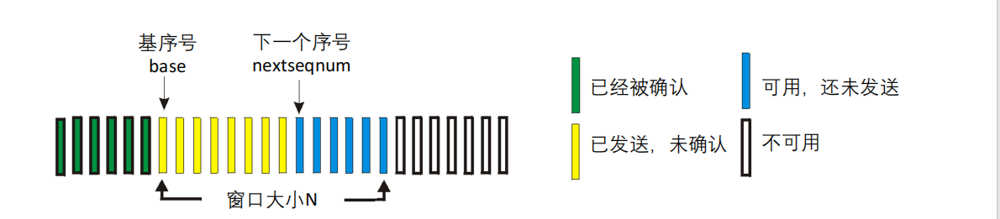
- GBN发送端状态机
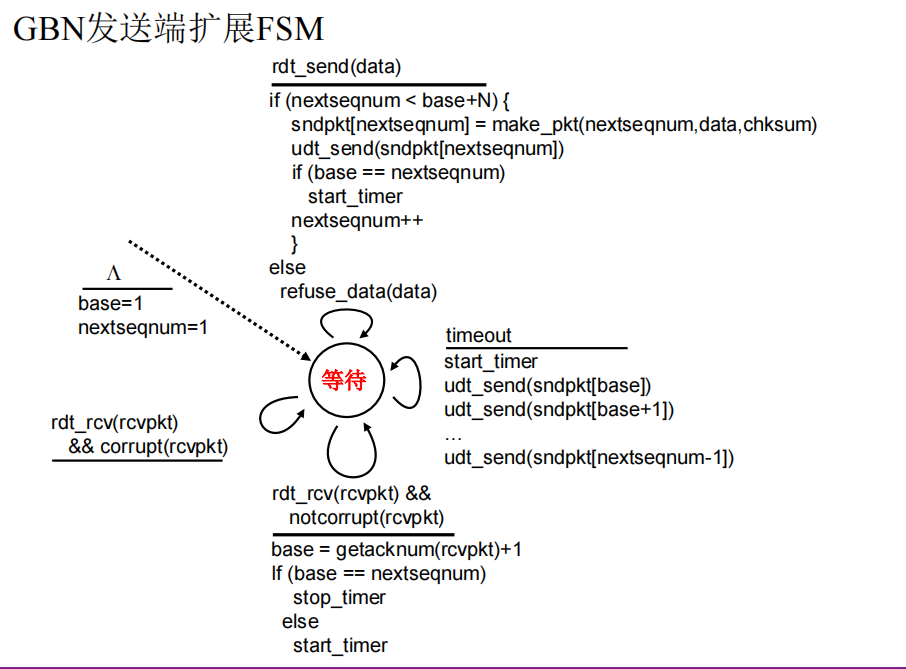
   
         状态机为我们的编程提供了实现思路：当窗口大小仍有剩余时，我们将持续打包发送消息。如果窗口大小不够，那么我们将进入等待，直到接收到新的ACK序号，并根据序号调整发送端的基址base为ack+1，或等待超时，将缓冲区中的包重新发送。
- GBN接收端状态机
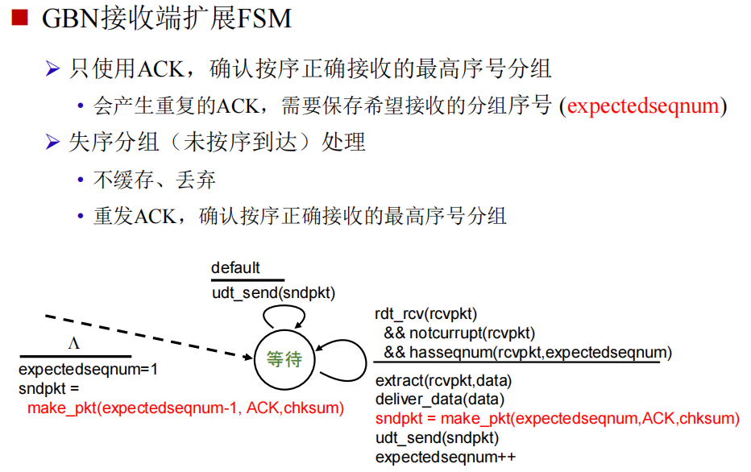
  

        接收端：不断接收发送过来的数据包，并确认按序接收的最高的序号分组。
## 3 代码实现
### 3.1 全局变量
为了实现GBN协议，我定义并维护了如下全局变量：

1.``base``:表示当前基序号

2.``nextseqnum``:表示将要发送的包的序号

3.``send_not_check``:为了实现超时重传所有已发送但未确认的数据包，设计了一个容器模板类send_not_check，将已发送但未确认的数据包保存于其中,待到超时的时候将从其中发送。
### 3.2 发送方
本次修改如下：

1.``send_packet``:发送数据包函数，用于不断发送数据包
```cpp
void send_packet(char *msg,int len)
{
   
    while (nextseqnum >= base + WND)
    {
        continue;
    }
      
    Packet*packet=new Packet;
    packet->header.seq = nextseqnum;
    packet->header.len = len;
    packet->header.checkSum = 0;
    if (len < MAX_DATA_LENGTH)
    {
        packet->header.flag = LAS;
    }
    memcpy(packet->Msg, msg, len);
    u_short chksum= cal_ck_sum((u_short*)packet, sizeof(packet->header) + len);
    packet->header.checkSum = chksum;
    // 压入缓冲区
    buffer_lock.lock();
    send_not_check.push_back(packet);
    //发送消息
    buffer_lock.unlock();
    sendto(client, (char*)packet, (sizeof(HeadMsg) + len), 0, (sockaddr*)&router_addr, rlen);
    print_lock.lock();
    cout << "向服务器发送数据包";
    cout << " seq:" << packet->header.seq << " ack: " << packet->header.ack << " type: " << packet->header.flag <<" checksum: " << packet->header.checkSum << endl;
    
    print_lock.unlock();
    if (base == nextseqnum)
    {
        my_timer.start_timer();
    }
        nextseqnum +=1;
}
```

2.``recv_thread：``
这个函数用于接收接收端返回的ACK数据包，通过累计确认的方式接收ACK数据包，将基址base调整到已接收数据包最高的下一个位置。同时启动计时器，若计时器超时，则重发所有存在send_not_check中的所有数据包，并重新启动计时器。
```cpp

    ioctlsocket(client, FIONBIO, &mode);
    char* recv_buffer = new char[sizeof(HeadMsg)];
    HeadMsg* header;

    while (true) {
        if (send_over) {
            mode = 0;
            ioctlsocket(client, FIONBIO, &mode);
            delete[]recv_buffer;
            return;
        }
        while (recvfrom(client, recv_buffer, sizeof(HeadMsg), 0, (sockaddr*)&router_addr, &rlen) <= -1) {
            if (send_over) {
                mode = 0;
                ioctlsocket(client, FIONBIO, &mode);
                delete[]recv_buffer;
                return;
            }
            if (my_timer.time_out()) {
                for (auto packet : send_not_check) {
                    sendto(client, (char*)packet, sizeof(HeadMsg) + packet->header.len, 0, (sockaddr*)&router_addr, sizeof(SOCKADDR_IN));
                    print_lock.lock();
                    cout << "超时重传数据包，首部为: seq:" << packet->header.seq << ", ack:" << packet->header.ack << ", flag:" << packet->header.flag << ", checksum:" << packet->header.checkSum << ", len:" << packet->header.len << endl;
                    print_lock.unlock();
                }
                my_timer.start_timer();
            }
        }
        header = (HeadMsg*)recv_buffer;
        int chksum = cal_ck_sum((u_short*)recv_buffer, sizeof(HeadMsg));
        if (chksum != 0) {
            continue;
        }
        else if (header->flag == ACK) {
            int recv_num = header->ack + 1 - base;
            for (int i = 0; i < recv_num; i++) {
                buffer_lock.lock();
                if (send_not_check.size() <= 0) {
                    break;
                }
                delete send_not_check[0];
                send_not_check.erase(send_not_check.begin());
                buffer_lock.unlock();
            }
            base = header->ack + 1;
            print_lock.lock();
            cout << "接收到来自服务器的数据包，首部为: seq:" << header->seq << ", ack:" << header->ack << ", flag:" << header->flag << ", checksum:" << header->checkSum << ", len:" << header->len << ", 剩余窗口大小:" << WND - (nextseqnum - base) << endl;
            print_lock.unlock();
        }
        if (base != nextseqnum) {
            my_timer.start_timer();
        }
        else {
            my_timer.stop_timer();
        }
    }

```
### 3.3接收方
接收方所需要做的为不断接收发送过来的数据包并回应相应的ACK数据包，只按序接收正确的数据包。
```cpp
void recv_file() {
    bool file_finish = false;
    int expectedseqnum = 1;
    HeadMsg header;
    // 接收缓冲和发送缓冲
    char* recv_buffer = new char[MAX_DATA_LENGTH+ sizeof(header)];
    char* send_buffer = new char[sizeof(header)];
    memset(recv_buffer, 0, MAX_DATA_LENGTH + sizeof(header));
    memset(send_buffer, 0, sizeof(header));
    // 先初始化一下send_buffer
    header.ack = ACK;
    header.checkSum = cal_ck_sum((u_short*)&header, sizeof(header));
    ioctlsocket(server, FIONBIO, &unblockmode);
    clock_t start=clock();
    while (true) {
        int result;
        while ((result = recvfrom(server, recv_buffer, MAX_DATA_LENGTH + sizeof(header), 0, (sockaddr*)&router_addr, &rlen)) <= 0) {

            if (file_finish == true && clock() - start > MAX_WAIT_TIME) {
                cout << "长时间没有接收到报文，断开连接";
                delete[]send_buffer;
                delete[]recv_buffer;
                ioctlsocket(server, FIONBIO, &blockmode);
                return;
            }
        }
        // 得到数据头
        memcpy(&header, recv_buffer, sizeof(header));
        cout << "接收到长度为" << result << "字节的数据报,头部为: ";
        cout << "seq: " << header.seq << " ack: " << header.ack << " flag: " << header.flag << " checksum: " << header.checkSum << " length: " << header.len << endl;
        u_short chksum = cal_ck_sum((u_short*)recv_buffer, result);
        // 校验和不对
        if (chksum != 0) {
            int n = sendto(server, send_buffer, sizeof(HeadMsg), 0, (sockaddr*)&router_addr, sizeof(SOCKADDR_IN));
            cout << "数据报校验和出错" << endl;
            continue;
        }
        // 接收到一个数据报文
        else if (header.seq == expectedseqnum) {
            // 发回一个ack
            HeadMsg reply_header;
            reply_header.ack = expectedseqnum;
            reply_header.flag = ACK;
            memcpy(send_buffer, (char*)&reply_header, sizeof(reply_header));
            chksum = cal_ck_sum((u_short*)send_buffer, sizeof(reply_header));
            ((HeadMsg*)send_buffer)->checkSum = chksum;
            int n = sendto(server, send_buffer, sizeof(reply_header), 0, (sockaddr*)&client_addr, sizeof(SOCKADDR_IN));
            cout << "发送ACK报文:" << "seq: " << reply_header.seq << " ack: " << reply_header.ack << " flag: " << reply_header.flag << " checksum: " << chksum << " length: " << reply_header.len << endl;
            expectedseqnum++;
            memcpy(message + messagepointer, recv_buffer + sizeof(header), header.len);
            messagepointer += header.len;
            //cout << "数据报成功获取" << endl;
            // 最后一个报文到了
            if (header.flag==LAS) {
                file_finish = true;
                start = clock();
                cout << "文件接收完毕" << endl;
                return;
            }
        }
        else {
            sendto(server, send_buffer, sizeof(HeadMsg), 0, (sockaddr*)&client_addr, sizeof(SOCKADDR_IN));
        }
    }
    delete[]send_buffer;
    delete[]recv_buffer;
    ioctlsocket(server, FIONBIO, &blockmode);
}
```
## 4.实验结果
实验结果展示如下：
超时重传机制：
我们可以发现，当滑动窗口剩余大小为0时，且长时间无法收到缓冲区中的数据包对应的ACK，那么将等待超时后将缓冲区中所有的数据包重新发送。
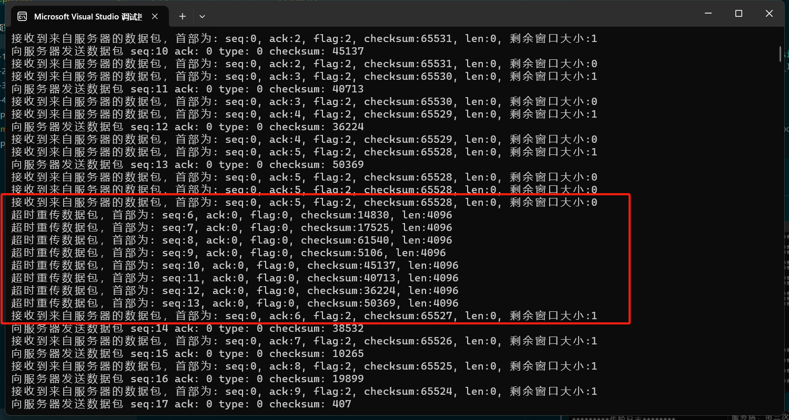
以下展示各个文件传输结果的成功图像：

**1.jpg**：
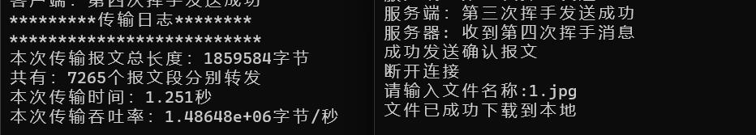
**2.jpg**：
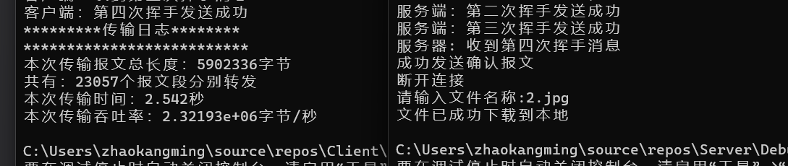
**3.jpg**：
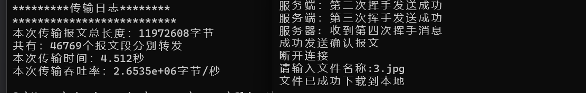
**helloworld.txt**：
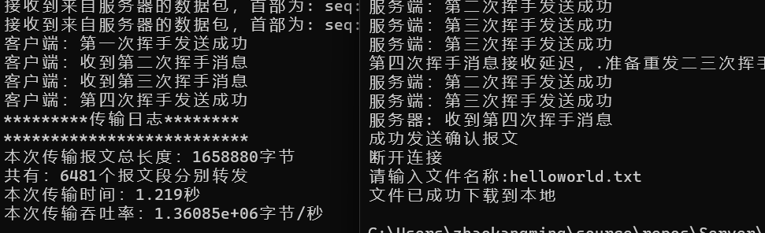

传输成功展示：
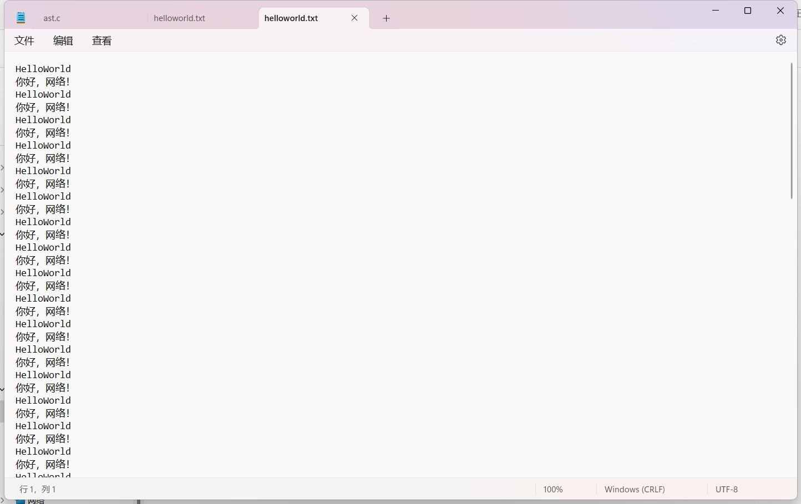

发送端：
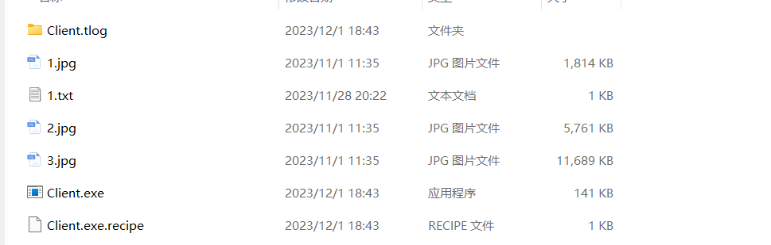
接收端：
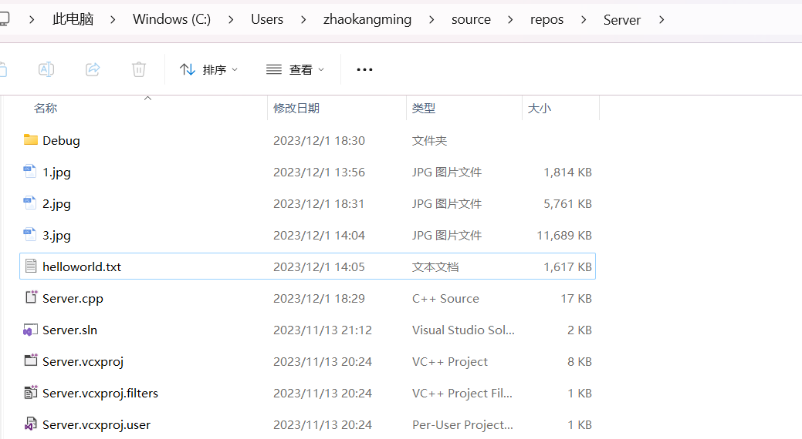

可以发现接收端的文件大小和发送端的文件大小一致，点开文件查看无数据损坏丢失等情况。

## 4.实验总结
本次实验完成了GBN信息传输协议，并采用累积确认的方式对发回的数据包进行验证。传输效率与停等协议相比有了巨大的提高。